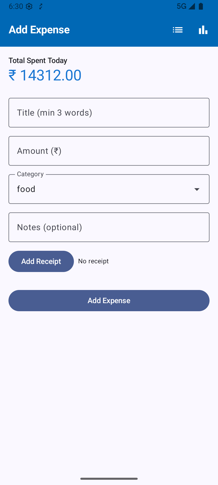
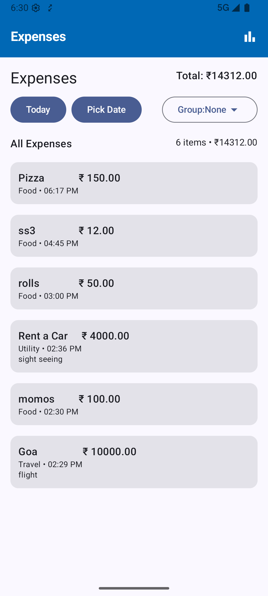
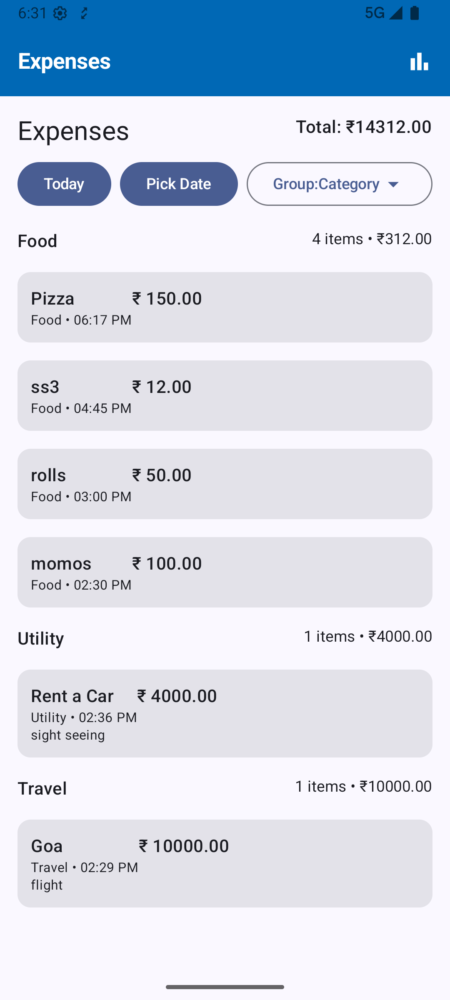
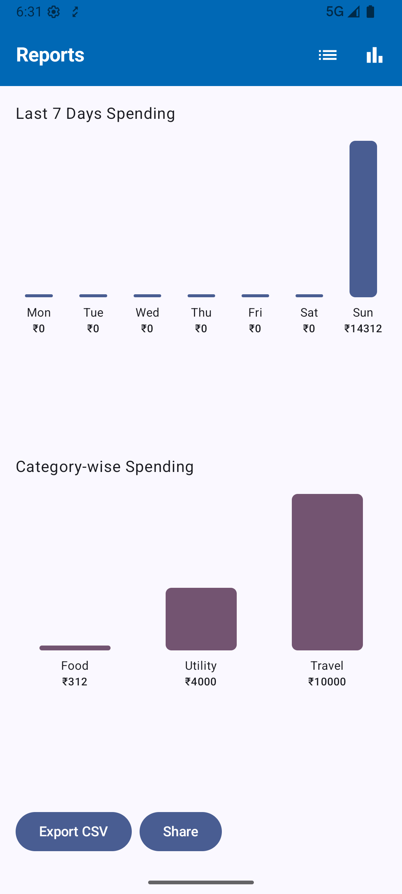
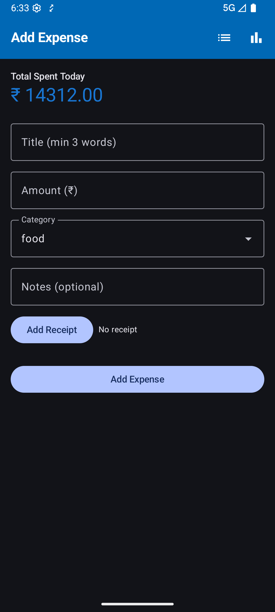
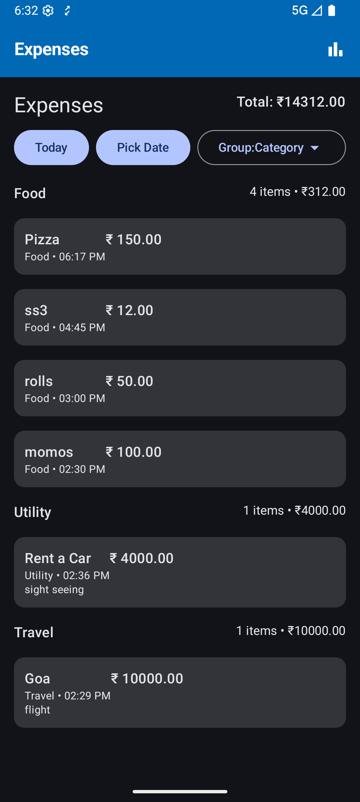
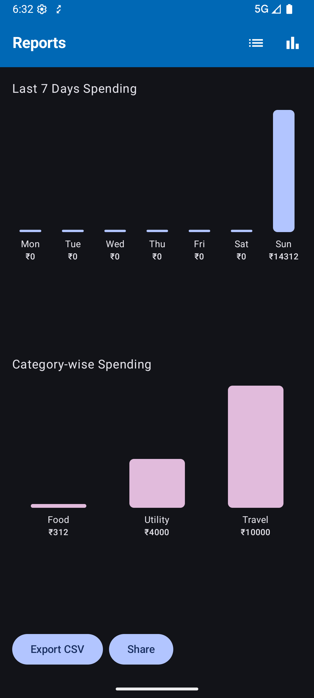

# Expense Tracker App

This is an Android expense tracking application built using Kotlin and Jetpack Compose. The app follows a clean and modular architecture that separates concerns into layers such as data, domain, UI, and dependency injection.

---

## Architecture Overview

The app uses a layered architecture inspired by the Clean Architecture and MVVM (Model-View-ViewModel) patterns:

- **Data Layer**: Responsible for data access and storage (local database), models and repositories that define business logic.
- **UI Layer**: Composable screens and navigation logic for user interaction.
- **DI Layer**: Dependency Injection setup using Koin (or any DI framework).
- **Utils**: Utility classes and constants used throughout the app.

---

## Folder Structure

### `data`

- **local**

  Contains the Room database setup:

    - `ExpenseDao`: Data Access Object for querying expenses.
    - `ExpenseDatabase`: Room database definition.
    - `ExpenseEntity`: Data entity representing an expense record.

- **model**

  Data models representing domain entities and aggregated data:

    - `CategoryTotal`: Model for category-wise totals.
    - `DailyTotal`: Model for daily expense totals.

- **repository**

  Contains repository interfaces and implementations that abstract data operations:

    - `ExpenseRepository`: Manages data operations between local database and ViewModels.

---

### `di`

Contains dependency injection modules:

- `AppModule.kt`: Configures DI bindings for ViewModels, repositories, and database.

---

### `ui`

- **navigation**

    - `NavGraph.kt`: Navigation graph defining routes and navigation logic between screens.

- **screens**

  Contains Compose UI screens grouped by feature:

    - `entry/ExpenseEntryScreen.kt`: Screen for adding new expenses.
    - `list/ExpenseListScreen.kt`: Screen for viewing expense list.
    - `report/ExpenseReportScreen.kt`: Screen showing expense reports and analytics.

- **theme**

  Contains Compose UI theming and styling files:

    - `Color.kt`: Color definitions.
    - `Theme.kt`: Theme setup.
    - `Type.kt`: Typography definitions.

- **viewmodel**

  Holds ViewModel classes for UI state and business logic:

    - `ExpenseEntryViewModel.kt`
    - `ExpenseListViewModel.kt`
    - `ExpenseReportViewModel.kt`

---

### `utils`

Contains utility classes and constants used throughout the app:

- `AppConstants.kt`: App-wide constant values.
- `BarChart.kt`: Custom bar chart implementation.
- `ExpenseTopBar.kt`: Top app bar composable used in screens.

---

## MainActivity

`MainActivity` is the entry point of the Android app. It extends `ComponentActivity` and sets the Compose UI content when created.

---

## APP

`APP` Initializes Koin dependency injection at app startup.

---

## Summary

- **Separation of concerns** between data, UI, and domain layers.
- **MVVM architecture** with ViewModels exposing state to Composables.
- **Room database** for local persistence.
- **Jetpack Compose** for modern, declarative UI.
- **Navigation Compose** for screen navigation.
- **Theming** managed via Compose theme files.
- **Dependency Injection** for scalable and testable code.

---

### Screenshots

## Light Mode:

---

## Dark Mode:

---
